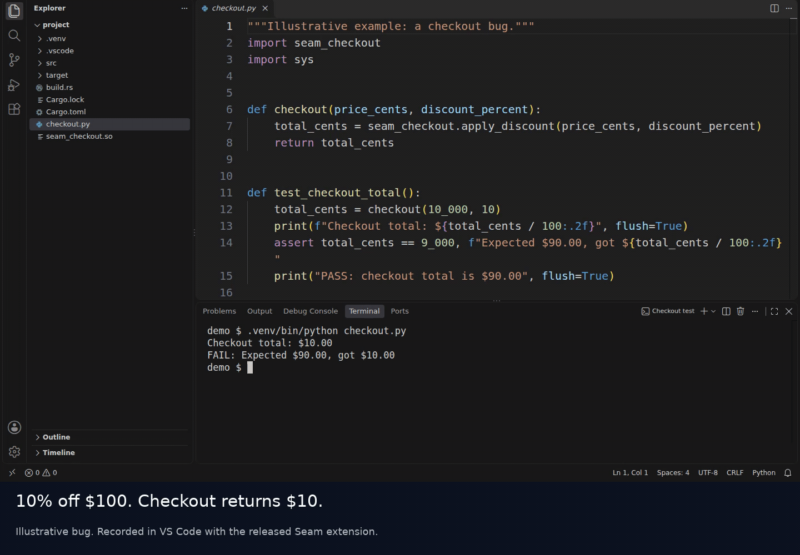

# Find a Rust bug from its Python caller

A checkout function applies a 10% discount to $100. The test expects $90, but gets
$10. Python passes the right inputs. Use Seam to step into Rust and find where the
result goes wrong.

[](https://raw.githubusercontent.com/ChirayuAgg0706/Seam/main/examples/checkout-bug/media/checkout-bug.mp4)

[Watch or download the 44-second video](https://raw.githubusercontent.com/ChirayuAgg0706/Seam/main/examples/checkout-bug/media/checkout-bug.mp4).
This is a deliberately broken teaching example. The recording uses real VS Code
debugging with Seam, with pauses cut out. It includes a rebuild after the fix.

## Before you start

You need VS Code, Git, CPython 3.12, 3.13 or 3.14, and a
[Rust toolchain](https://doc.rust-lang.org/book/ch01-01-installation.html).
Use a normal CPython build, with the GIL enabled. On Windows, run the commands in
WSL and open the project in a WSL window. On Apple Silicon, use native ARM64 Python.
See Seam's [platform requirements](../../README.md#requirements).

Install LLDB before starting the debugger. On Ubuntu 24.04 or its WSL distribution:

```bash
sudo apt-get update
sudo apt-get install -y lldb-19 build-essential python3-venv git
```

On macOS, Apple's command-line tools provide LLDB and the linker:

```bash
xcode-select --install
```

Skip that command if the tools are already installed. macOS's system Python is too
old for Seam; use a supported Python installation.

Install [Seam from the VS Code Marketplace](https://marketplace.visualstudio.com/items?itemName=chirayuagg0706.seam-debugger).
In a WSL window, install it on the WSL side. The extension includes the debugger;
you do not need to install Seam with pip.

## Get the example

Clone into a new directory so your existing Seam checkout stays separate:

```bash
git clone --depth 1 https://github.com/ChirayuAgg0706/Seam.git seam-checkout-demo
cd seam-checkout-demo/examples/checkout-bug
python3 --version
```

The last command must show CPython 3.12, 3.13 or 3.14. If needed, use a versioned
command such as `python3.12` in the next command instead of `python3`.

```bash
python3 -m venv .venv
source .venv/bin/activate
cargo build --locked
case "$(uname -s)" in
  Darwin) cp target/debug/libseam_checkout.dylib seam_checkout.so ;;
  *) cp target/debug/libseam_checkout.so seam_checkout.so ;;
esac
python checkout.py
```

The build includes Rust debug information. Copying the library to `seam_checkout.so`
lets Python import it from this directory. The committed Cargo lockfile fixes the
dependency versions used by the example.

The first run is supposed to fail with exit code 1:

```text
Checkout total: $10.00
FAIL: Expected $90.00, got $10.00
```

## Find the bug

Open this example folder in VS Code:

```bash
code .
```

If `code` is not on your PATH, use **File > Open Folder** and choose
`seam-checkout-demo/examples/checkout-bug`. On Windows, open that folder through
WSL. Trust the folder when VS Code asks so debugging can run.

1. Open the Command Palette and run **Seam: Check This Machine**. Continue when it
   says `Seam is ready to use.` The example's launch configuration uses `.venv`.
2. Open `checkout.py`. Set a breakpoint on the line
   `total_cents = seam_checkout.apply_discount(price_cents, discount_percent)`.
3. Press F5 to start **Debug checkout**. In Variables, check `price_cents = 10000`
   and `discount_percent = 10`. The example stores money in cents.
4. Use **Step Into**. Seam opens `src/lib.rs` inside `apply_discount`.
5. Use **Step Over** until `discount_cents` appears in Locals with the value `1000`.
   Rust has calculated the discount correctly. Look at what the function returns.
6. In Call Stack, select Python's `checkout` frame. You can inspect its inputs
   while execution remains paused in Rust.

The error is in the return value. The function returns the discount amount instead
of the price after the discount.

## Fix it and rerun

Stop the debugging session. In `src/lib.rs`, change only the return expression:

```diff
 fn apply_discount(price_cents: u64, discount_percent: u64) -> u64 {
     let discount_cents = price_cents * discount_percent / 100;
     assert!(discount_cents <= price_cents);
-    discount_cents
+    price_cents - discount_cents
 }
```

Save the file. In the example directory, rebuild Rust, copy the rebuilt library
and run the same Python test again:

```bash
source .venv/bin/activate
cargo build --locked
case "$(uname -s)" in
  Darwin) cp target/debug/libseam_checkout.dylib seam_checkout.so ;;
  *) cp target/debug/libseam_checkout.so seam_checkout.so ;;
esac
python checkout.py
```

It now exits successfully:

```text
Checkout total: $90.00
PASS: checkout total is $90.00
```

The assertion in Rust is present in both versions. It also keeps the discount local
available at the inspection point. The return expression is the only bug fix.

## Try your own extension

Build your extension with debug information, put a breakpoint on its Python call,
and Step Into. Seam supports PyO3, C API, pybind11, nanobind and Cython extensions.
The [quick start](../../README.md#quick-start) explains interpreter selection and
launching your own program.

At a native stop, Seam can read Python caller variables from memory. Evaluating
Python expressions requires a safe Python stop. Optimized builds can lose locals
or source lines, and child processes are not debugged. Read the
[full limitations](../../README.md#limitations) for your project.

If the example fails before the expected checkout assertion, run the machine check
and [report what happened](https://github.com/ChirayuAgg0706/Seam/issues).
Include your OS, Python and LLDB versions, the command or debugging step that failed,
and the machine-check output. Review logs for private paths before sharing them.

Recorded with Seam extension 0.1.4 and debugger 0.1.2 on Linux/WSL. The walkthrough
was checked with the public Marketplace package. The example is for debugging
practice, not a complete checkout or money-handling implementation.
