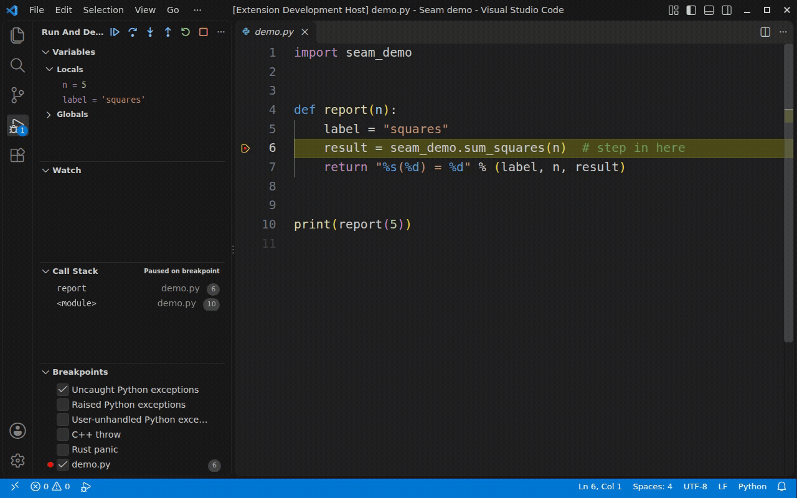
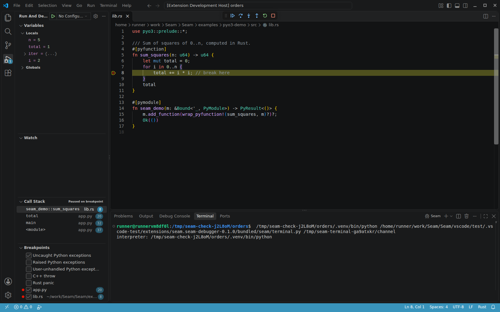
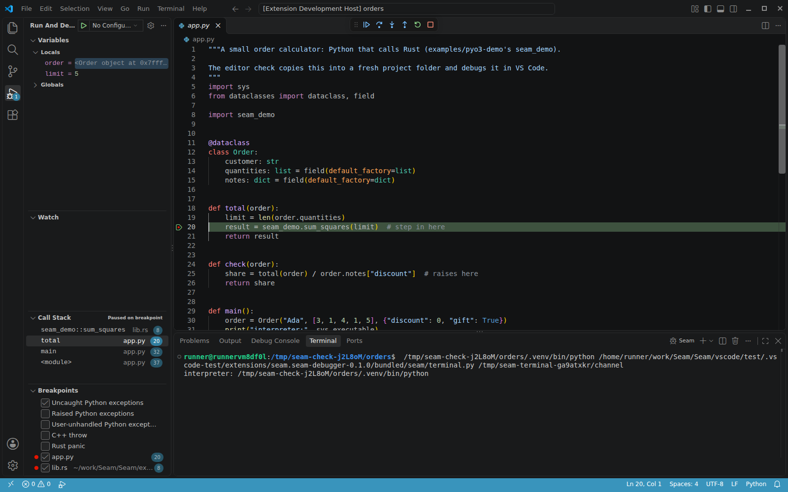
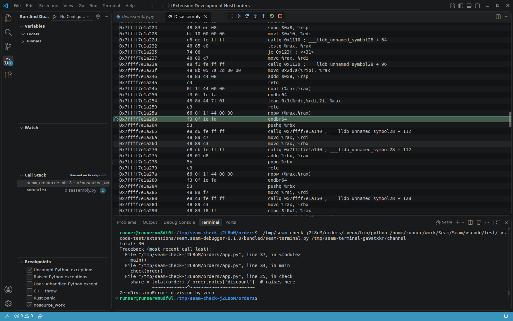

# Seam for VS Code

Debug Python and C, C++ or Rust in one session on Linux x86-64, including WSL.

Step Into a native function called by Python, inspect its variables, and Step Out
to Python. Set breakpoints in either language. The call stack shows Python and
native frames in the order they ran.

Seam supports C API, PyO3, pybind11, nanobind and Cython extension modules.



Recorded with the packaged extension. Python calls Rust's `sum_squares` and
receives `30`. The recording starts at a Python breakpoint.

## Install

Seam runs on Linux x86-64 with glibc. On Windows, open your project in WSL and
install Seam on the WSL side. Native Windows, macOS and ARM are outside the
supported scope.

On Ubuntu 24.04, install LLDB in a Linux or WSL terminal:

```bash
sudo apt-get update
sudo apt-get install -y lldb-19
```

Install [Seam from the Marketplace](https://marketplace.visualstudio.com/items?itemName=chirayuagg0706.seam-debugger),
then open the Command Palette and run **Seam: Check This Machine**.
It checks dependencies and the project interpreter, runs a debug session,
and reports what to fix.

The extension includes the debugger and compiled helper. You do not need to
install Seam with pip or compile it. A Linux x64 VSIX is also available from
[GitHub Releases](https://github.com/ChirayuAgg0706/Seam/releases).
Install it with **Extensions: Install from VSIX...** in a Linux or WSL window.

## Requirements

- LLDB with Python scripting support. Versions 18, 19 and 20 are tested.
  Use 19 or 20 for new installations. Seam chooses `lldb-20`, then `lldb-19`,
  then `lldb`. Set `SEAM_LLDB` to override that choice. The machine check warns
  about LLDB 18's threaded-child-process session failure.
- CPython 3.12, 3.13 or 3.14 for your program. Python 3.15.0rc3 also passes the
  compatibility tests; later 3.15 builds have not been validated for this release.
- Build your native extension with debug information for source stepping. Use
  `-g` for C and C++, a Rust debug build, or `[profile.release] debug = true`
  for Rust release builds. Building your extension still needs its toolchain.

Seam runs its adapter with the program's interpreter when possible, then tries
other Python installations on the machine. It needs Python 3.12 or newer to run
the adapter. If Python or LLDB is missing, VS Code reports why it cannot start.

## Start debugging

1. Open your project and a Python file.
2. Set a breakpoint on a line that calls your native extension.
3. Press F5. If VS Code asks, choose **Seam: Python + native**.
4. Use Step Into to enter the native function. Step Out returns to Python.

You do not need a `launch.json`. To save a configuration:

```json
{
  "type": "seam",
  "request": "launch",
  "name": "Seam: current file",
  "program": "${file}"
}
```

For a runnable example, use the
[Python and Rust demo](https://github.com/ChirayuAgg0706/Seam/blob/main/examples/pyo3-demo/README.md).

### Choose an interpreter

Seam uses the interpreter selected in Microsoft's Python extension. Without that
selection, it checks `python.defaultInterpreterPath`, then `.venv` and `venv` in
the workspace, then `python3`. Set `"python"` in the launch configuration to choose
one explicitly. The Seam output channel records the choice.

### Attach to a running program

```json
{
  "type": "seam",
  "request": "attach",
  "name": "Seam: attach",
  "pid": "${command:seam.pickProcess}"
}
```

The picker lists your Python processes with their process IDs, interpreters and
working directories, newest first. You can also set `"pid"` to a number. Attach needs
ptrace permission. For a process that is not a child, `ptrace_scope` must be 0,
or the process must allow tracing. The main thread must be able to load Seam's helper.

## Inspect the program



- Set breakpoints in `.py`, `.c`, `.cpp`, `.rs` and `.pyx` files as usual. Conditions, hit
  counts and log messages work on both sides.
- The Breakpoints view offers five exception stops: uncaught Python exceptions (on by
  default), raised Python exceptions, user-unhandled Python exceptions, C++ throw and Rust panic.
- The program runs in the integrated terminal, so it can read input. Set
  `"console": "internalConsole"` to send its output to the Debug Console instead.
- A crash in native code (segfault, abort) stops at the faulting line, with the Python
  frames that led there.

At a native stop, select a Python caller to inspect its locals and globals without
running Python in the paused process:



When a native frame has no source, select it in Call Stack and choose
**Open Disassembly View**. With that view focused, Step Into and Step Over
advance one instruction at a time.



The [main README](https://github.com/ChirayuAgg0706/Seam#readme) lists every launch option.

## Limitations

- Linux x86-64 is the supported platform, including WSL. Native Windows, macOS,
  ARM, Alpine/musl, free-threaded Python, PyPy and the experimental JIT are outside
  the validated scope.
- At native stops, Python values are read from memory. Simple built-in types show
  values; other objects show their type and address. Python evaluation, object
  expansion and mutation require a safe Python stop.
- Optimised native code can lose source lines, locals or frames. A debug build gives
  the most reliable source stepping.
- Child processes run but are not debugged. Use LLDB 19 or 20 to avoid LLDB 18's
  threaded-child-process session failure.
- An evaluated expression that crashes or times out can damage the program.
  Restart the session before evaluating again.
- Attach needs ptrace permission and a responsive interpreter; blocked-process
  attach and remote debugging are outside the supported scope.
- Disassembly breakpoints are not supported. Thread-heavy workloads can run about
  twice as slowly; there is no universal low-overhead guarantee.

See the [complete limitations](https://github.com/ChirayuAgg0706/Seam#limitations).

## Settings

| Setting | Meaning |
|---|---|
| `seam.adapterCommand` | Leave empty to use the included debugger. To use another installation, set a command such as `["/path/to/venv/bin/seam", "dap"]`. |
| `seam.logFile` | Set a file path to record protocol messages for troubleshooting. |

## Troubleshooting

Run **Seam: Check This Machine** first. For a grey native breakpoint, check debug
information and compiler optimisation. If source paths changed after the build,
the Debug Console suggests a `sourceMap` entry when possible.

For a [bug report](https://github.com/ChirayuAgg0706/Seam/issues), include the machine-check
output, what failed, and how to reproduce it. Set `seam.logFile`, reproduce the
problem, and include that log, its `.lldb` companion and the Seam output channel.
Check logs for private paths and values before sharing them.

## Building from source

Run `scripts/build-vsix.sh` from the repository to build a Linux x64 VSIX.
Passing a wheel path uses the adapter and helper from that wheel. See the
[contributor guide](https://github.com/ChirayuAgg0706/Seam/blob/main/CONTRIBUTING.md).
